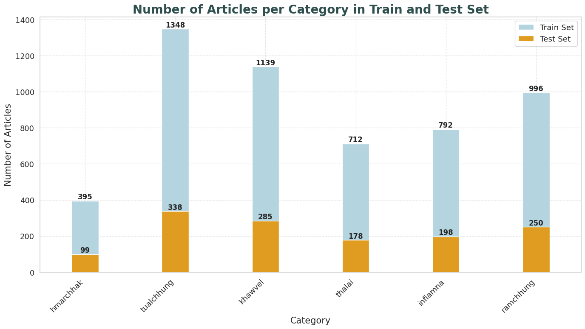

# Twirling Mizo News Dataset

## Description
The **Twirling Mizo News Dataset** is a collection of 6,731 news articles written in the Mizo language. The dataset is categorized into six distinct categories, making it a versatile resource for various Natural Language Processing (NLP) tasks, such as text classification, topic modeling, and language understanding.

## Dataset Structure
- **Total Entries:** 6,731
- **Columns:**
  - **Article:** Contains the news articles written in Mizo.
  - **Category:** The category to which each article belongs.
    - **Unique Categories:** 6
    - Categories include:
      - *tualchhung*
      - *khawvel*
      - *ramchhung*
      - *infiamna*
      - *thalai*
      - *hmarchhak*

- **Largest Category:** *tualchhung* (1,686 articles)
- **Training Set (80%)**: This set contains 80% of the data for each category and will be used for training machine learning models.
- **Testing Set (20%)**: This set contains the remaining 20% of the data for each category and can be used for evaluating the performance of the models.



The bar chart above shows the distribution of articles across different categories in the train and test sets.

### Example Split

For each category, the dataset is split as follows:

1. **Category**: "tualchhung"
   - **Training Set**: 80% of articles in this category.
   - **Testing Set**: 20% of articles in this category.
   
2. **Category**: "khawvel"
   - **Training Set**: 80% of articles in this category.
   - **Testing Set**: 20% of articles in this category.

This pattern is applied to all categories in the dataset, ensuring that the splits are balanced and representative of each category.

## How to use

The `datasets` library allows you to load and pre-process your dataset in pure Python, at scale. The dataset can be downloaded and prepared in one call to your local drive by using the `load_dataset` function. 

```python
from datasets import load_dataset

twirling_mizo_news_train = load_dataset("andrewbawitlung/twirling_mizo_news", split="train")
twirling_mizo_news_test = load_dataset("andrewbawitlung/twirling_mizo_news", split="test")

```
display 3 random indices
```python
import random
for split, dataset in [("train", twirling_mizo_news_train), ("test", twirling_mizo_news_test)]:
    print(f"Random samples from the {split} dataset:")
    for idx in random.sample(range(len(dataset)), 5):
        print(f"Index: {idx}\n{dataset[idx]}\n{'-' * 50}")

```


## Potential Use Cases
This dataset is suitable for:
- **Text Classification:** Train models to classify news into the six predefined categories.
- **Language Modeling:** Build language models specifically for Mizo.
- **Topic Analysis:** Explore the distribution of news topics in the Mizo language.

## Sample Data
| Article | Category |
|---------|----------|
| Assam sorkar chuan hri leng dona kawng hnathawh zawng zawng an buatsaih leh mek thu an sawi | hmarchhak |
| Nagaland mi Covid-19 kai pakhat hmuh a nih thu chhuah nghal a ni | hmarchhak |

---

This dataset is ideal for researchers and developers interested in exploring or advancing NLP tasks in the Mizo language.


## Citation

**BibTeX entry and citation info:**

```
@inproceedings{bawitlung2023approach,
  title={An Approach to Mizo Language News Classification Using Machine Learning},
  author={Bawitlung, Andrew and Dash, Sandeep Kumar and Lalramhluna, Robert and Gelbukh, Alexander},
  booktitle={International Conference on Data Science and Network Engineering},
  pages={165--180},
  year={2023},
  organization={Springer}
}
